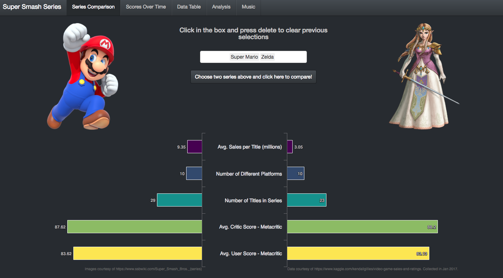
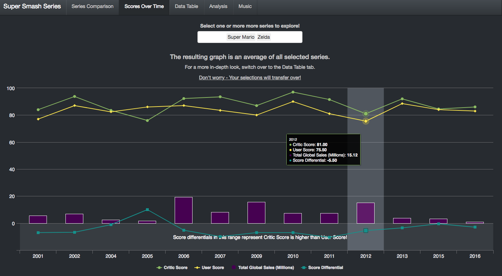
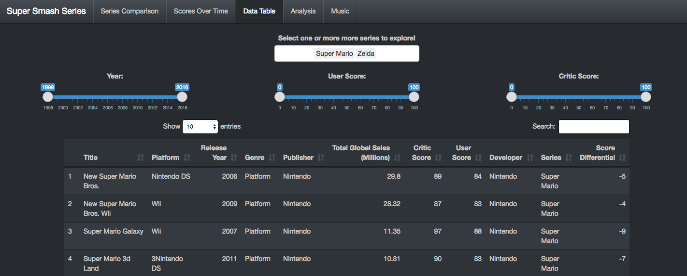
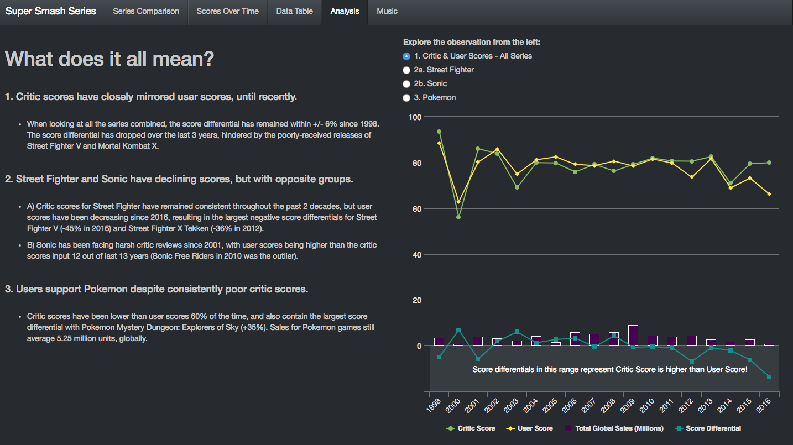

# Video Game Battle Royale!

### Inspiration
My parents are really young, so I've grown up around video games ever since I was born. My parents would stay up late at night to play Ultima on the original Nintendo, while my brother and I would play Mario during the day. I'm still not positive that my controller was ever really plugged in or functional, but my love for video games has only grown.

For this project, I wanted to look at how various video game series have trended over time. How has Mario sold over the years? How have various Pokemon games been received by critics each generation, and how does that compare to the way users rate the same game?

### Data Selection
I found a dataset that was available through  which provided review data from a review company named IGN. I was also able to find sales data for a smaller group of games through , which was joined to the review data.

### Data Cleaning
The data was clean, so a lot of the data cleaning was focused around finding video game franchises that had enough data and titles to present a clear historical picture. I used the dplyr package from R to filter through the available data, then summarized the data on a yearly basis.

### Visualizations
I used  to create my visualizations and had a really great experience with the package. Highcharter is an R wrapper for the JavaScript visualization package highchart. I knew that I wanted to have a lot of control over the look and feel of the visualizations, and found that the highchart API allowed for complete control over your presentation, from tooltips to plot options.

The fourth tab contains a table, which was created by using the default Shiny table (renderHighchart). I found that the default shiny table provided all of the standard features that were needed, and was presentation-ready straight from the box.

### Storytelling
I wanted my application to begin at a very general level, then increase in granularity as the user switched tabs. My first tab is a general introduction to my project, allowing users to make compare two franchises and see basic summary statistics, while the following tabs allow for additional visualizations, and even allow the user to see a table full of data for each title released.

Another feature that was important to me from a user's perspective was making sure that selections persisted when changing tabs after the initial exploration on the first tab. When a user selects two franchises on the second tab, those selections persist to the following tab, which allows the user to focus on the new information presented to them as the granularity increases, rather than focusing on "maintenance" features. The user is welcome to change franchises at any point, but that is a convenience rather than a requirement.

## Packages Used

* **Shiny** for creating the application.
* **dplyr** for data manipulation. Handled filtering and summarizing data on the fly.
* **Highcharter** for data visualizations.
* **stringi** for regex searching and filtering.

## Project Screenshots

### First Tab:

### Second Tab:

### Third Tab:

### Fourth Tab:

## Lessons Learned
* **Sketch Out Everything** - the exchange between the UI and Server side of Shiny can become really complicated. The exchanges between the user input and the server output can be referenced multiple times, especially when trying to make user selections persist between tabs, so having a diagram can really help with troubleshooting problems.
* **Keep Your Code Clean** - I did a terrible job at this, but this was a turning point for me. I learned that I work best when I keep as much of my code in the same worksheets as possible, rather than breaking my projects into many smaller scripts.
* **Comment Everything** - My visualizations had a lot of specific settings thanks to highcharter's API capabilities, so I found that I need to comment which part of my visualizations I was working on, since I often broke my visualizations.
